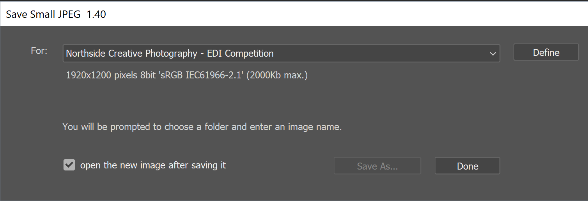
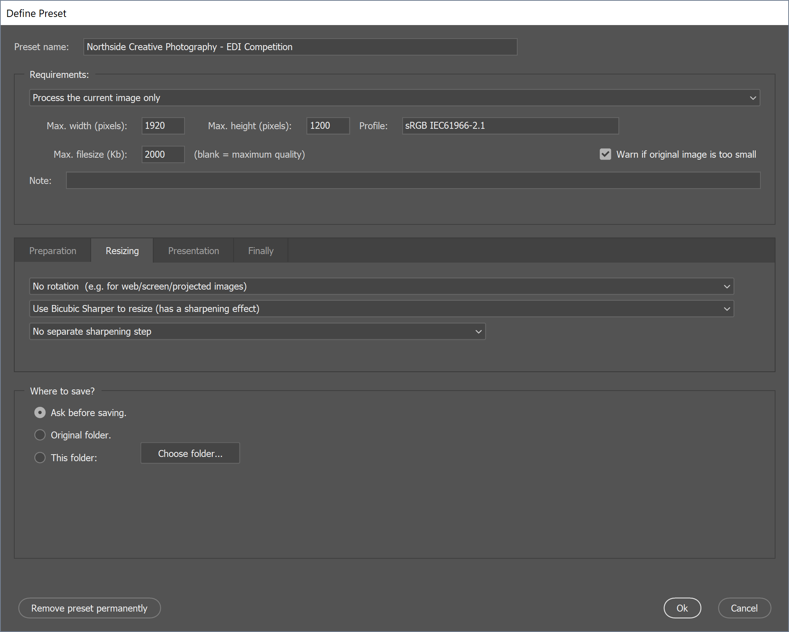

# Save Small JPEG

**Save Small JPEG** is simple and quick to use Adobe Photoshop script for preset based exporting of small images indvidually or as batch of images from a folder.

For example to export a single image with the provided preset:

* open the image in Photoshop
* run the script
* click the "SaveAs..." button.

The script can be used to rotate, add borders and run photoshop actions for each image processed making it useful for exporting images for books, web or supermarket printers.

## Screenshots

The main window:

The preset settings window:

## Features

* Export settings are stored as a named preset.
* Define multiple presets.
* Constrain images to fit within width and height.
* Exports as sRGB.
* Optional maximum file size, maximises quality while fitting in specified file size.
* Folder processing mode - for batch processing.
* Optional, subfolder destination templates.
* Optional photoshop actions.
* Optional rotation, scaling and border options.
* Optional Bruce Fraser sharpening for digital display.
* Preset file is a simplified XML file that could be distributed.
* Simple user interface.

Interal processing workflow:  duplicate, flatten, resize, sharpening, scaling on canvas, convert to profile, convert to 8bit, save reducing quality until specified filesize achieved.

## Where to download

Save the script to a folder on your computer from this link: [savesmalljpeg.jsx](https://raw.githubusercontent.com/codebybrett/savesmalljpeg/master/savesmalljpeg.jsx).  Depending on your browser you may need to right-click on the link and use the "Save Target As..." or "Save Link As..." option.

## How to run the script

The simplest way: in Photoshop use File/Scripts/Browse and load the script. Done.

Or for ongoing convenience: copy the script to your Photoshop .../Presets/Scripts folder, then you can access it by File/Scripts/Save Small JPEG...

## Making presets

The first time the script is run it creates a default preset. Any changes you make are saved in a file in your photoshop settings folder when you exit the script.

To create a new preset, first choose an existing preset that's close to what you want, click "Define" and then enter a new name for it. Make any settings changes for the new preset and click "Ok".

The default preset is designed to make life easy for members of the camera club I attend, but can be removed. To remove a preset you click the "Remove preset permanently" button. This button is enabled once there are more than one presets defined.

### Defining a preset

Click the "Define" button to open the settings for a preset.  Make changes as necessary and Click "Ok" to save the changes or click "Cancel" (or hit Esc key) to cancel changes.

The settings here determine what images are procesed (one more many), how the images are processed, where the images are saved to and how they are named.

The tabs "Preparation", "Resizing", "Presentation" and "Finally" provide options for each of the processing steps of an image.

### Folder processing

Folder processing of images in a batch can be activated by changing "Process the current image only" to "Process all images in a folder".  The operation of the main dialog changes for this option.

On the main dialog, a "Browse" button becomes available to choose the folder of images to process. The "Run" button starts the batch process.

### Photoshop upgrades and versions

If you upgrade Photoshop you may find that your settings of the script are not avaiable in the new version. Photoshop stores settings per version so if you want you can manually copy the the script's settings file to the new version of photoshop.

At the time of writing for example my script settings file is stored in this location on Windows:

    C:\Users\brett\AppData\Roaming\Adobe\Adobe Photoshop CC 2018\Adobe Photoshop CC 2018 Settings

The script settings file is called:

    SaveSmallJpegSettings.xml
